# What dis?
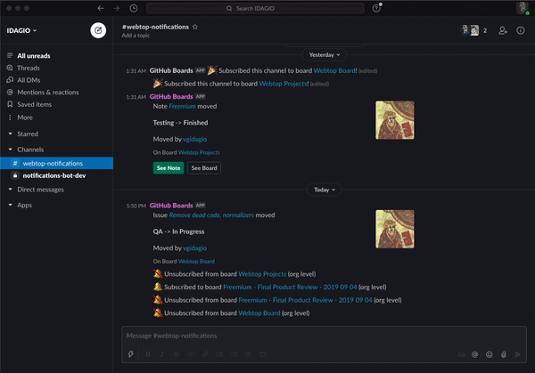

This repository contains a lambda function that receives GitHub Board updates (via GitHub Webhook) and forwards them to Slack.
It allows the user to select which Slack channels get notified when a change is received.

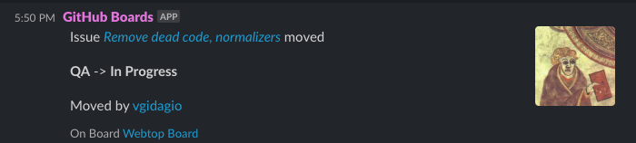
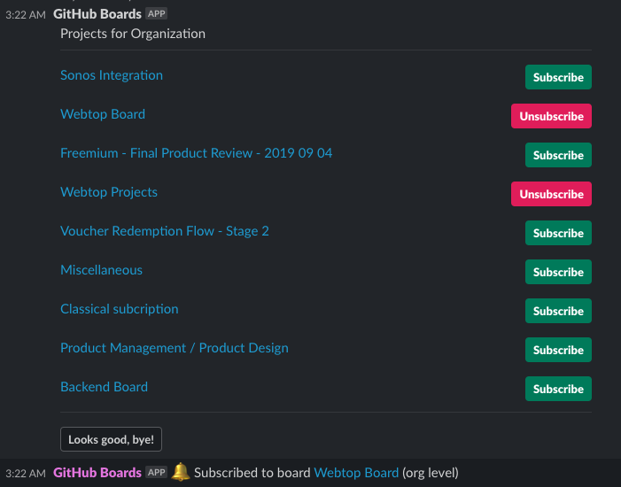

# Getting started

The setup looks more difficult than it is, the steps in the overview should be easy to follow.

## Prerequisites
1. Install [Serverless cli](https://www.serverless.com/framework/docs/getting-started/) (with AWS)
2. Get access to Slack API to [create apps](https://api.slack.com/apps)
3. Have privis' to add Webhooks to your org, url looks like so
``` 
https://github.com/organizations/<YOUR ORG NAME>/settings/hooks
```

## Overview
1. Set up a Slack App, extract the newly generated **Verification Token** and the **OAuth Token** 
   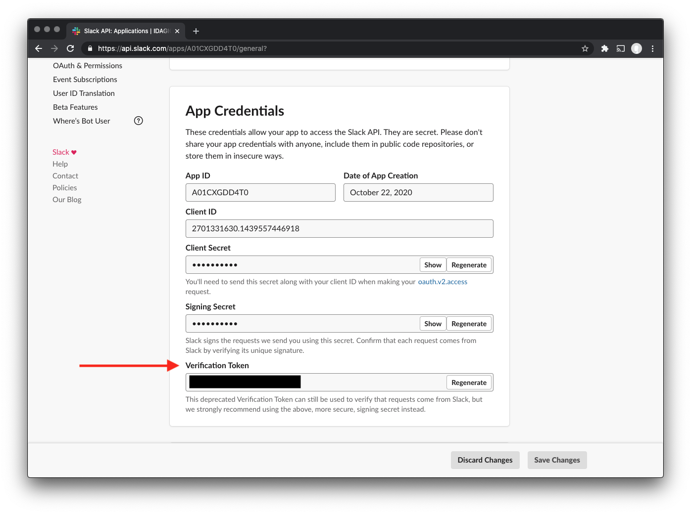
   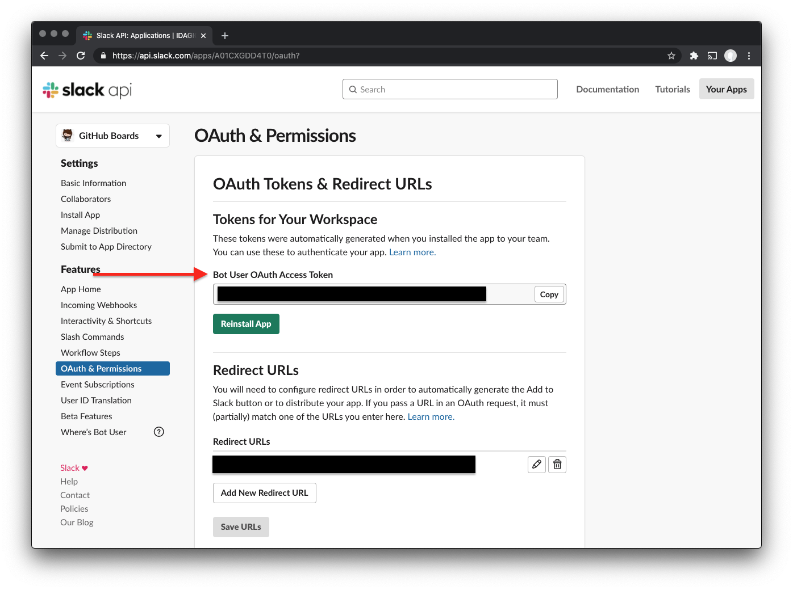

2. Set up a Personal Github Token for the bot; give it repo access - [here](https://github.com/settings/tokens)
   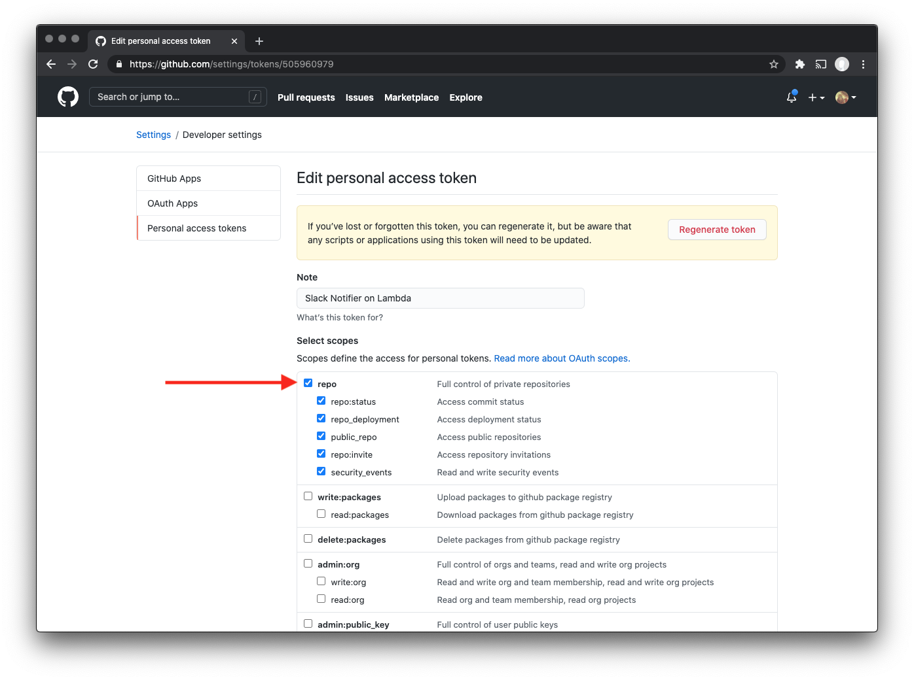
3. Decide on the `GITHUB_WEBHOOK_SECRET` or [generate one](https://www.howtogeek.com/howto/30184/10-ways-to-generate-a-random-password-from-the-command-line/)
3. Configure the function, [see below](#configure-the-function)
4. Deploy the function: `$ sls deploy`
5. Get the two urls: Github webhook and Slack events
   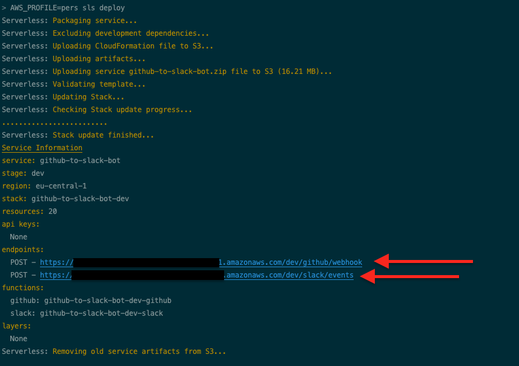
6. Set up a GitHub Webhook using the `URL` and the `SECRET`; Only give it permissions to boards
   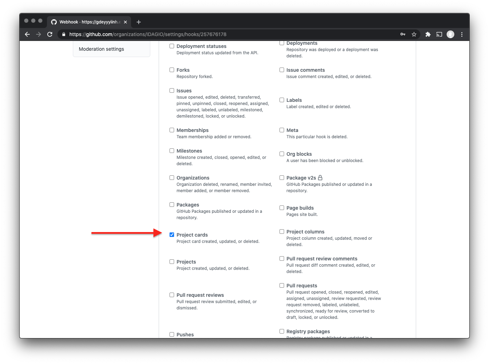
7. Finish up the Slack App configuration, [see below](#set-up-the-slack-app)
8. done 💪

### Configure the function*

Copy `serverless.yml.sample` into `serverless.yml` and change your vars in the 
`environment` section.

```
$ cp serverless.yml.sample serverless.yml
```

 - `GITHUB_TOKEN` - Your personal GitHub token
 - `GITHUB_WEBHOOK_SECRET` - The secret you've configured on the webhook in GitHub
 - `GITHUB_ORG` - Your organisations' name as defined on GitHub (in the url)
 - `SLACK_OAUTH_TOKEN` - The oauth token of your Slack app, super important
 - `SLACK_VERIFICATION_TOKEN` -  This token is used to verify that the request is actually coming from slack (similar to the `GITHUB_WEBHOOK_SECRET` but generated by Slack)

### Set up the Slack App**
1. Under **Interactivity & Shortcuts** add a *Request URL*, something like 
   ```
   <BASE URL>/dev/slack/events
   ```
   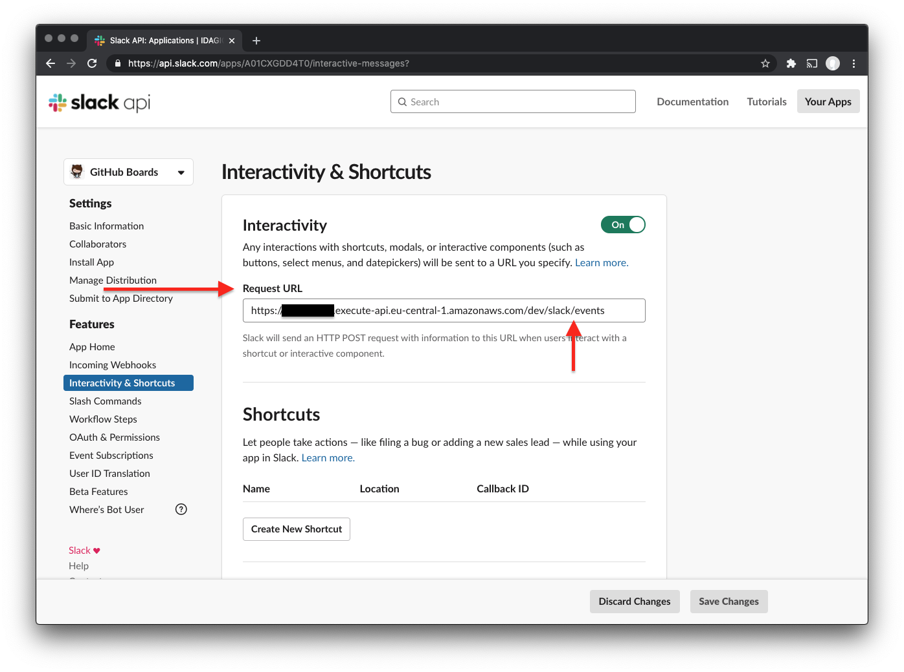
2. Under **Slash Commands**, proceed to *Create a new command* set the *Command* as `/list-projects` with the same *Request URL*
   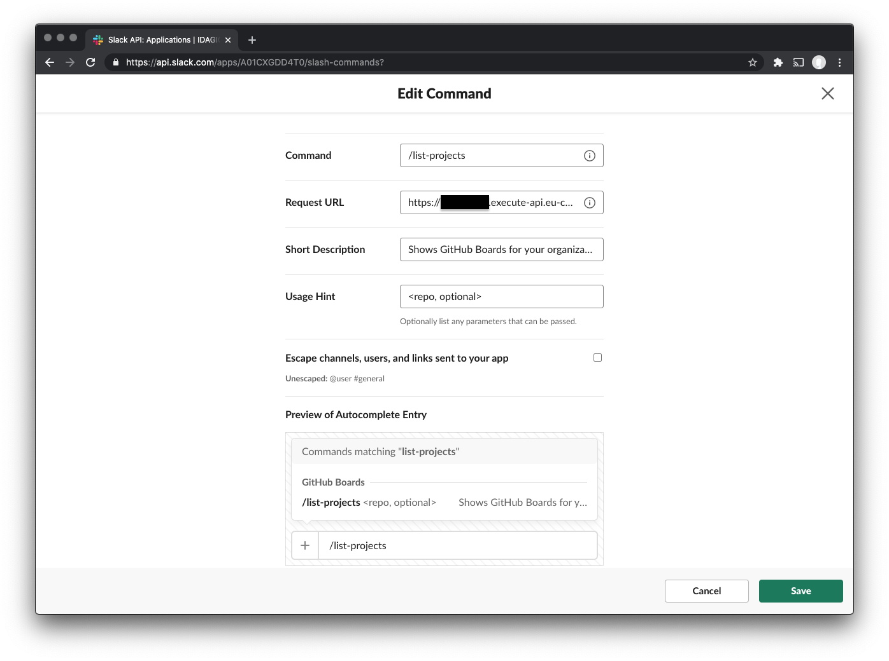
3. Under **OAuth & Permissions** > **Bot Token Scopes**, proceed to *Add an OAuth Scope*, add `chat:write`
   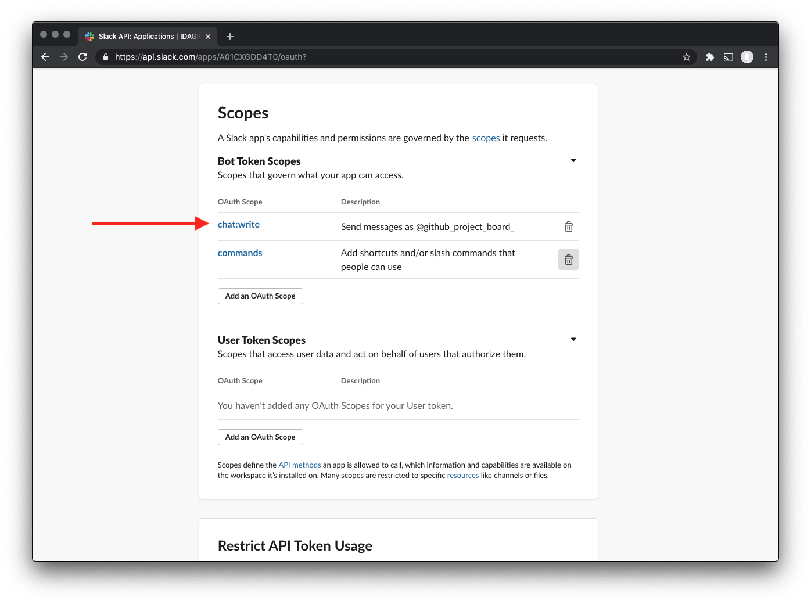


## Logs
```bash
$ sls logs -f github
$ sls logs -f slack 
```

Also `--tail` will give you a running log.

## Local invocation
```
$ nvm use 12
$ sls invoke local -f slack -p ./fixtures/move.json
```

